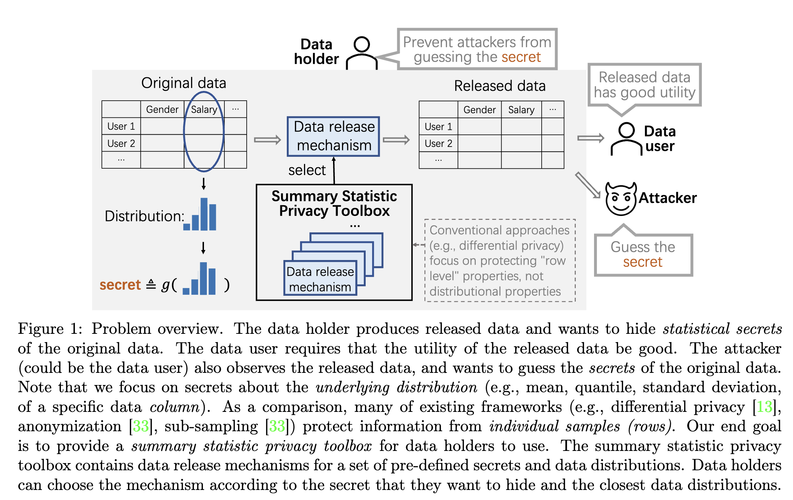

# Summary Statistic Privacy in Data Sharing

**[[paper (arXiv)](https://arxiv.org/abs/2303.02014)]**
**[[code](https://github.com/fjxmlzn/summary_statistic_privacy)]**


**Authors:** [Zinan Lin*](https://zinanlin.me/), [Shuaiqi Wang*](https://www.linkedin.com/in/shuaiqi-wang-204636245/), [Vyas Sekar](https://users.ece.cmu.edu/~vsekar/), [Giulia Fanti](https://www.andrew.cmu.edu/user/gfanti/) 

\*: Equal contribution

**Abstract:** Data sharing between different parties has become increasingly common across industry and academia. An important class of privacy concerns that arises in data sharing scenarios regards the underlying distribution of data. For example, the total traffic volume of data from a networking company can reveal the scale of its business, which may be considered a trade secret. Unfortunately, existing privacy frameworks (e.g., differential privacy, anonymization) do not adequately address such concerns. In this paper, we propose summary statistic privacy, a framework for analyzing and protecting these summary statistic privacy concerns. We propose a class of quantization mechanisms that can be tailored to various data distributions and statistical secrets, and analyze their privacy-distortion trade-offs under our framework. We prove corresponding lower bounds on the privacy-utility tradeoff, which match the tradeoffs of the quantization mechanism under certain regimes, up to small constant factors. Finally, we demonstrate that the proposed quantization mechanisms achieve better privacy-distortion tradeoffs than alternative privacy mechanisms on real-world datasets.

## Summary Statistic Privacy



See the [paper](https://arxiv.org/abs/2303.02014) for the detailed formulation.

## Summary Statistic Mechanisms

> **Limitations:** Our current mechanisms can only handle 1-dimensional data, 1 secret, and do not provide composition guarantees.

Examples for using the mechanisms:

### Secret=Mean

See Section 6.1, Section 6.3, and Figure 6.a for details.

```Python
>>> from summary_static_privacy_mechanisms import mean_mechanism
>>> mean_mechanism(samples=[0.1,0.2,0.3], s=0.1)
array([0.15, 0.25, 0.35])
```


### Secret=Quantile

See Section 6.2 and Figure 6.c for details.

```Python
>>> from summary_static_privacy_mechanisms import quantile_mechanism
>>> quantile_mechanism(samples=[0.1, 0.2, 0.3], s=0.2, alpha=0.5)
array([0.15, 0.3 , 0.45])
```

### Secret=Fractions

See Section H.2 and Figure 6.b for details.

```Python
>>> from summary_static_privacy_mechanisms import fraction_mechanism
>>> fraction_mechanism(samples=[1, 1, 1, 1, 2, 2, 3, 3, 3, 3], s=0.2, class_=1)
array([3, 3, 1, 2, 1, 1, 1, 1, 3, 3])
```

